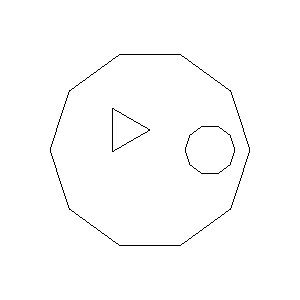
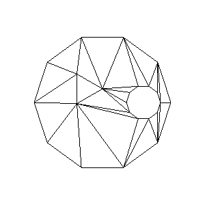
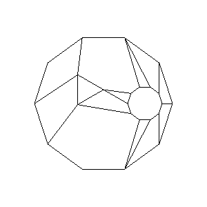

## poly-partition-js

Modified from [PolyPartition](https://github.com/ivanfratric/polypartition).

#### Functions

* `removeHoles(polygon: Contour, holes: Contour[], doNotCheckOrdering?: boolean): Contour`
* `triangulate(polygon: Contour, doNotCheckOrdering?: boolean): Contour[]`
* `convexPartition(polygon: Contour, doNotCheckOrdering?: boolean): Contour[]`

`Contour` is `{ x: number, y: number }[]`, counterclockwise for non-holes, clockwise for holes.

#### Example

Inputs:



```javascript
const merged = removeHoles(polygon, [hole1, hole2], true);
```


```javascript
const triangles = triangulate(merged, true);
```



```javascript
const convexes = convexPartition(merged, true);
```


